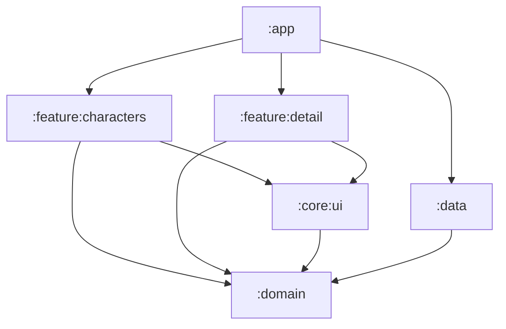
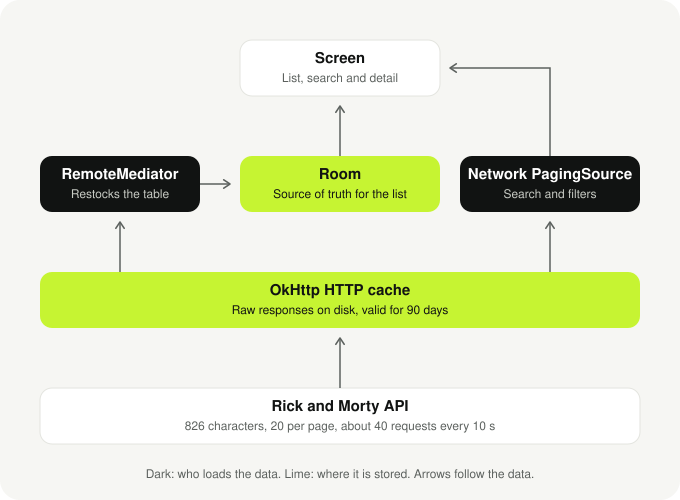

# Rick and Morty Characters

An Android app to browse every character of the show, built on the public [Rick and Morty API](https://rickandmortyapi.com/).

Browse the paginated list, search by name, filter by status and gender, and open a character to see its details and every episode it appears in. The list you have already seen keeps working without a connection.

| List | Detail | Filters |
|---|---|---|
|  |  |  |

## Running it

Requirements: a recent Android Studio with JDK 17. The project uses AGP 9.3.3, Kotlin 2.4.10 and Gradle 9.5.0 through the wrapper. `minSdk` is 26, `targetSdk` 36 and `compileSdk` 37.

| Command | What it does |
|---|---|
| `./gradlew :app:installDebug` | Installs the app on a connected device or emulator |
| `./gradlew test` | Runs the 81 JVM tests |
| `./gradlew connectedDebugAndroidTest` | Runs the 27 instrumented tests; needs a device |
| `./gradlew validateDebugScreenshotTest` | Compares components and screen states with their reference screenshots |

No API key is needed.

## Architecture

Clean architecture with MVVM and unidirectional data flow, split in six Gradle modules so that the layering is enforced by the compiler and not by convention.

| Module | Contents |
|---|---|
| `:domain` | Models, repository contracts, `AppResult`/`AppError`, use cases. Pure Kotlin/JVM, no Android |
| `:data` | Retrofit, Room, Paging sources, mappers, repositories. Everything is `internal` |
| `:core:ui` | Theme, design tokens, shared composables, image loading |
| `:feature:characters` | List, search and filters |
| `:feature:detail` | Character detail and episodes |
| `:app` | Application, navigation, dependency wiring |

### Why it is built this way

- **Dependencies point to the domain.** ViewModels depend on interfaces declared in `:domain`; `:data` implements them and Hilt binds them in `:app`. A feature cannot import Retrofit or Room because they are not on its classpath (dependency inversion, checked by the compiler).
- **One reason to change per class.** The `RemoteMediator` only moves pages from the network into Room, the search `PagingSource` only answers queries, mappers only translate, and the repository only chooses between them (single responsibility).
- **Small contracts.** Two repository interfaces, characters and episodes, so the detail does not know that paging exists (interface segregation). Every test swaps them for fakes (Liskov substitution).
- **Errors are values.** Exceptions are translated in `:data` into a sealed `AppError`. Adding an error is adding a case, and the compiler points at every `when` that must handle it (open/closed).
- **ViewModels depend on use cases, never on repositories.** One rule with no exceptions to remember. The detail use case holds real logic: it shows the character at once, then its episodes, and keeps the character if the episodes fail. The two list use cases are thin today; they are the price of a presentation layer that never sees where data comes from.
- **Every screen has a stateless half** that only receives state and callbacks. Previews and UI tests use it without Hilt, network or database.
- **The features do not know each other.** `:app` owns the navigation keys.

## Data and caching

The API returns 826 characters in fixed pages of 20, so the list is paginated with Paging 3. Its load states map one to one to the screens of the design: skeleton, "loading more", append error, offline bar and empty.

**Room is the source of truth for the list.** The screen only reads the database. A `RemoteMediator` fetches pages and writes them to Room, Room invalidates its `PagingSource`, and the grid updates. That gives response caching and offline reading with a single mechanism.

**Search and filters go straight to the network.** Caching arbitrary query results in the same table would leave gaps in a list that is paged by id, so they use their own `PagingSource`.

**There are two caches, with different jobs.** The API answers with `cache-control: public, max-age=7776000, immutable`, so turning on OkHttp's cache covers everything that does not go through Room. Room caches what the app needs to query and observe; HTTP caches what it only needs to read again.

| What the app asks for | Cached in | Without a connection |
|---|---|---|
| Unfiltered list | Room | Everything already loaded |
| Detail opened from the list | Room | Available |
| Search and filters | HTTP cache | Queries already made |
| Episodes of a character | HTTP cache, one batch request | Available once seen |
| Images | Coil, memory and disk | Available once seen |

**Room decides when to check with the server, and HTTP makes checking cheap.** The list is considered fresh for 24 hours. After that the refresh asks the server to revalidate, and a `304` with no body is the answer when nothing changed. If the request fails, Room keeps what it had and the list shows an offline bar.

### The API rate limit

The API allows about 40 requests every 10 seconds per IP and then answers `429` to everything, with a `Retry-After` header. Every card is one image request, so a fast scroll through new characters used to exhaust the budget: images stayed grey and pagination failed. I measured it with `curl` first; my first fix, more concurrency and preloading, made it worse and was removed.

- **Two client-side budgets** per 10 seconds: 28 image requests and 8 API requests, so the list keeps paginating while images wait.
- **One shared backoff.** After a `429`, every request waits until the time the server asked for.
- **Waiting requests can be cancelled**, so a card that leaves the screen spends no budget.
- **Images retry on their own** and show a shimmer while they wait.

## Testing

108 tests, 81 on the JVM and 27 instrumented, plus 26 screenshot comparisons. They are written where there is a decision and not where there is delegation. They use fakes; there is no mocking library in the project.

- **Contract tests** against real API responses: parsing rules, the `404` that means "no results", HTTP caching and rate limiting.
- **Data**: mappers, the search `PagingSource`, the rate limiter, and the `RemoteMediator` against a real in-memory Room.
- **Presentation**: debounce and filter combination, state restored after process death, and the mapping from load states to screens.
- **Compose UI**: empty, error and offline states, the filters draft, and the detail with its optional fields and episodes.

## Libraries

| Library | Why |
|---|---|
| Jetpack Compose, Material 3 | UI |
| Navigation 3 | Navigation with a back stack the app owns |
| Paging 3 | Pagination and load states |
| Room | Local source of truth for the list |
| Retrofit, OkHttp, kotlinx.serialization | Network and JSON, without reflection |
| Hilt | Dependency injection |
| Coil 3 | Image loading with memory and disk cache |

Icons are vector drawables drawn for the app, and the shimmer and the collapsing header are a few lines of code each, to avoid dependencies for small things.

## Credits

Data and images come from the [Rick and Morty API](https://rickandmortyapi.com/). The typefaces are Bricolage Grotesque, Instrument Sans and DM Mono, all under the SIL Open Font License.
