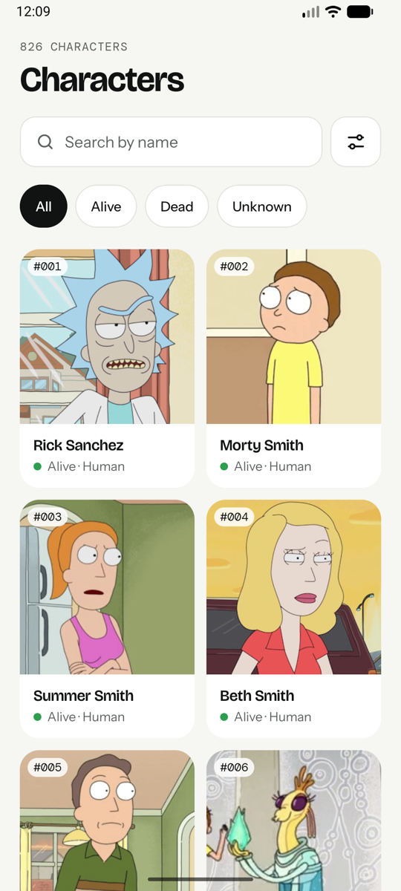
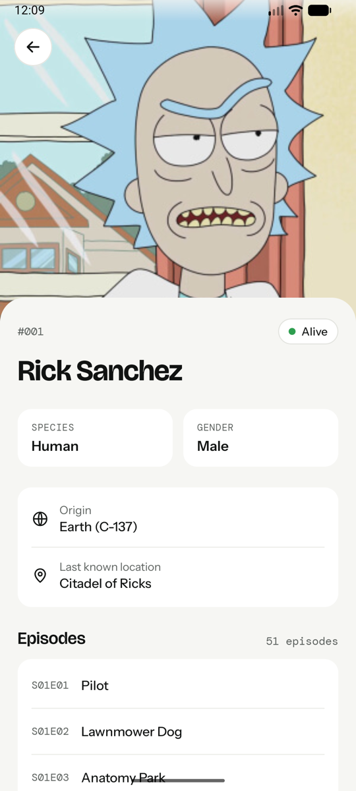
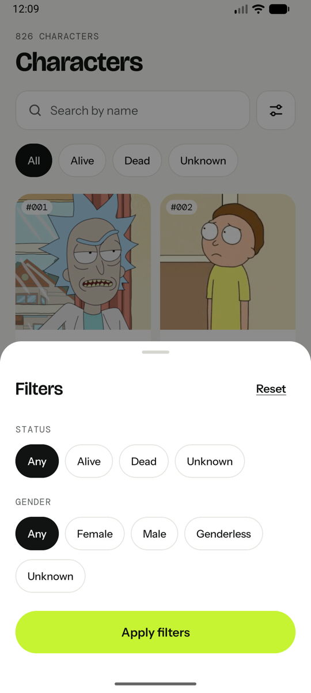
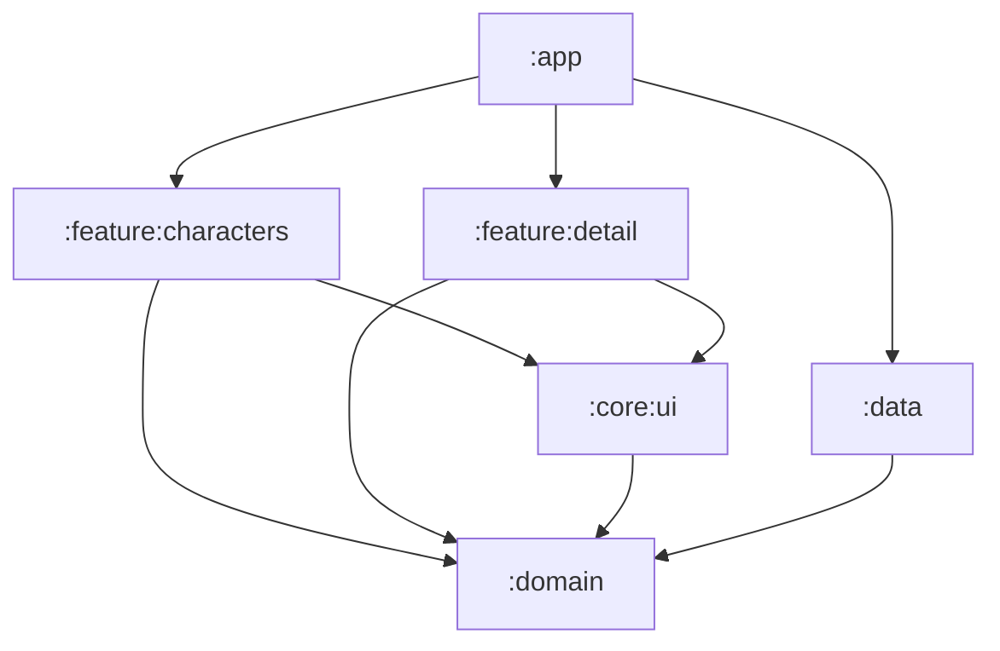
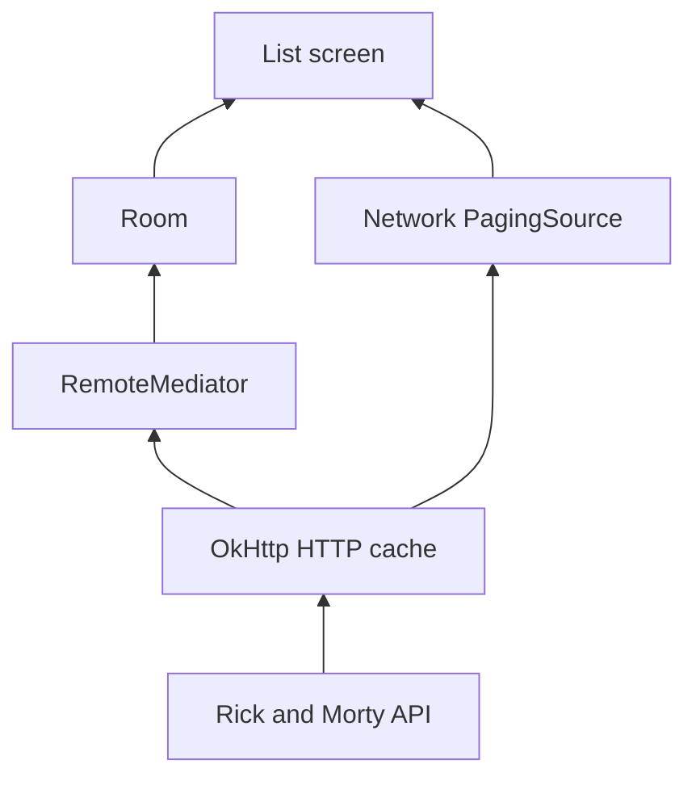

# Rick and Morty Characters

An Android app to browse every character of the show, built on the public [Rick and Morty API](https://rickandmortyapi.com/).

Browse the paginated list, search by name, filter by status and gender, and open a character to see its details and every episode it appears in. The list you have already seen keeps working without a connection.

| List | Detail | Filters |
|---|---|---|
|  |  |  |

## Running it

Requirements: a recent Android Studio with JDK 17. The project uses AGP 9.3.3, Kotlin 2.4.10 and Gradle 9.5.0 through the wrapper. `minSdk` is 26, `targetSdk` 36 and `compileSdk` 37.

```bash
./gradlew :app:installDebug          # install on a connected device or emulator
./gradlew test                       # 76 JVM tests
./gradlew connectedDebugAndroidTest  # 27 instrumented tests, needs a device
```

No API key is needed.

## Architecture

Clean architecture with MVVM and unidirectional data flow, split in six Gradle modules so that the layering is enforced by the compiler and not by convention.



| Module | Contents | Depends on |
|---|---|---|
| `:domain` | Models, repository contracts, `AppResult`/`AppError`, one use case. Pure Kotlin/JVM | nothing |
| `:data` | Retrofit, Room, Paging sources, mappers, repositories. Everything is `internal` | `:domain` |
| `:core:ui` | Theme, design tokens, shared composables, image loading | `:domain` |
| `:feature:characters` | List, search and filters | `:domain`, `:core:ui` |
| `:feature:detail` | Character detail and episodes | `:domain`, `:core:ui` |
| `:app` | Application, navigation, dependency wiring | all of them |

The feature modules never see `:data`: a screen cannot import Retrofit or Room because they are not on its classpath. They also do not know each other; `:app` owns the navigation keys.

### How data reaches the screen



- **The unfiltered list reads only from Room.** A `RemoteMediator` fetches pages from the network and writes them to the database; Room invalidates its `PagingSource` and the grid updates. The screen never talks to the network.
- **Search and filters go straight to the network** through a `PagingSource`, because the API is the only place that can answer an arbitrary query.
- **The detail reads Room first** and falls back to the network when the character came from a search. Its episodes are requested in a single batch call.

## Decisions and trade-offs

### Paging 3 with Room as the source of truth

The API returns 826 characters in fixed pages of 20, so pagination is not optional. I used Paging 3 because its `LoadState` maps one to one to the states of the design: skeleton, "loading more", append error with retry, offline bar and empty.

Room holds the unfiltered list, which gives response caching and offline reading with one mechanism. The cost is two data paths, one through Room and one through the network. I accepted it because caching arbitrary search results in the same table would leave gaps in a list that is paged by id.

### One row of paging state instead of per-item remote keys

The usual `RemoteMediator` sample stores a row of keys per item. This list only grows downwards and there is a single query against Room, so one row is enough: `nextPage`, `totalCount` for the header, and `updatedAt` to decide whether the cache is still fresh. It would not be enough if filtered lists were cached too.

### Two caches with different jobs

The API answers with `cache-control: public, max-age=7776000, immutable`, so enabling OkHttp's cache gives HTTP caching for free on everything that does not go through Room: search, detail and episodes.

- **Room** caches what the app needs to query and observe.
- **HTTP** caches what the app only needs to read again.

Room decides when it is time to check with the server (after 24 hours) and the refresh sends `Cache-Control: no-cache`, so the server answers with a bodyless `304` when nothing changed.

### The API rate limit

The API allows roughly 40 requests per 10 seconds per IP and then answers `429` to everything, JSON included, with a `Retry-After` header. Every card is one image request, so a fast scroll through new characters used to exhaust the budget: images stayed grey and pagination failed.

I measured it with `curl` before changing anything, and my first fix (more concurrency and preloading) made it worse, so I removed it. What is in place now:

- **Two client-side budgets** in a sliding window: 28 image requests and 8 API requests per 10 seconds. The API keeps its own budget so the list keeps paginating while images wait.
- **One shared backoff.** When any response is a `429`, every request waits until the time the server asked for, instead of each one sleeping on its own and blocking the few download threads.
- **Cancellable waits.** A card that leaves the screen gives its slot back without spending budget.
- **Images retry on their own** up to three times and show a shimmer while they wait.

What the client cannot fix: seeing all 826 characters for the first time takes a few minutes of budget. After that every image comes from the disk cache.

### Use cases only where there is a decision

There is one use case, `GetCharacterDetailUseCase`. It emits the character as soon as it is available, then its episodes, and keeps the character on screen if the episodes fail. The list and the counter are pure delegation, so their ViewModel talks to the repository directly.

### Errors as values

Infrastructure exceptions are translated in `:data` into a sealed `AppError`, wrapped in `AppResult`. A sealed type keeps every `when` exhaustive, which `kotlin.Result` cannot do. `CancellationException` is always rethrown.

The same HTTP `404` means three different things in this API, and each is decided where the context is known: no results on the first page of a search, end of pagination on a later page, and "not found" on a single character.

Every error in this app is a state with its retry next to it. There are no one-off user actions that can fail, so there is no event channel or Snackbar.

### `paging-common` in the domain

`PagingData` appears in the repository contract, so `:domain` depends on an AndroidX artifact. It is a pure Kotlin/JVM artifact and plays the same role as `Flow`: the standard vocabulary for the problem. The cost is that replacing the paging library would touch the domain.

### UI

- **Design tokens** for colour, typography and shape, in light and dark, exposed through `CompositionLocal`. Text styles keep the names of the design (`cardName`, `eyebrow`) instead of being forced into Material slots.
- **Every screen is split** into a stateful half that asks Hilt for the ViewModel and a stateless half that only receives state and callbacks. Previews and UI tests use the stateless half.
- **Shared element transition** from the card image to the detail header. The image URL travels in the navigation key so the image exists on the first frame of the detail.
- **Cards receive primitives**, not the domain model, so every parameter is stable and unchanged cards skip recomposition.
- **Accessibility**: 48 dp touch targets on 44 dp controls, minimum heights instead of fixed ones so large fonts do not clip, headings, live regions on state messages, and status never conveyed by colour alone.
- **Short windows**: under 480 dp of height the header collapses with the scroll.

### Navigation 3

The back stack is a list owned by the app, and keys are `@Serializable` types with typed arguments. The detail ViewModel receives the character id through Hilt assisted injection.

## Testing

103 tests: 76 on the JVM and 27 instrumented. The rule is to test where there is a decision, not where there is delegation.

| Area | What is protected |
|---|---|
| API contract (MockWebServer, real responses) | Unknown fields ignored, defaults, missing required fields fail, bracketed episode batches, HTTP cache, rate-limit handling |
| `safeApiCall` | The order of the `catch` clauses and that cancellation is rethrown |
| Mappers | Enum fallbacks, blank and "unknown" values, malformed episode URLs |
| Search `PagingSource` | A `404` is an empty page on the first page and the end of pagination afterwards |
| Rate limiter and backoff | Sliding window and server penalty, with a fake clock |
| `RemoteMediator` (instrumented, real Room) | 24-hour freshness, a failed refresh keeps the cache, refresh replaces instead of accumulating |
| ViewModels | Debounce, filter combination, state restored after process death, retry |
| List state | The mapping from `LoadState` to screen state, including the "not loaded yet" trap |
| Compose UI (instrumented) | Empty, error and offline states, the filters draft, optional fields, episode expansion |

Fakes are used instead of mocks throughout; there is no mocking library in the project.

## Libraries

| Library | Why |
|---|---|
| Jetpack Compose, Material 3 | UI |
| Navigation 3 | Navigation with a back stack the app owns |
| Paging 3 | Pagination and load states |
| Room | Local source of truth for the list |
| Retrofit, OkHttp, kotlinx.serialization | Network and JSON, without reflection |
| Hilt | Dependency injection |
| Coil 3 | Image loading with memory and disk cache |

Icons are vector drawables drawn for the app, and the shimmer and the collapsing header are a few lines of code each, to avoid dependencies for small things.

## With more time

- Retry automatically when connectivity comes back, instead of waiting for the user.
- Cache search results so search works offline.
- Convention plugins to remove the repeated Gradle configuration.
- Static analysis and CI.
- A baseline profile for startup and scroll performance.

## Credits

Data and images come from the [Rick and Morty API](https://rickandmortyapi.com/). The typefaces are Bricolage Grotesque, Instrument Sans and DM Mono, all under the SIL Open Font License.
